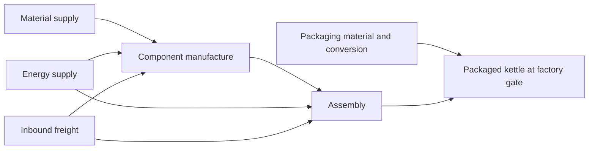

# Decision log

## 2026-10-08 — Before calculation

- **Study unit:** one manufactured and packaged BC1 1 L plastic electric kettle at the factory gate. Include material supply, component manufacture, assembly, and packaging. Exclude customer delivery, use, and end of life from the common result.
- **BOM evidence:** the classroom CSV cites the EU Electric Kettles preparatory study (2020), Task 4, Tables 4-3, 4-4, and 4-8. The cited original could not yet be reached from this cloud machine, so the classroom CSV is the directly verified input. Its ten kettle rows sum to 723.00 g; two packaging rows sum to 137.80 g.
- **Geography:** actual factory location is unknown. The initial computational scenario will be labeled **US-modelled**, because the accessible Commons Merged package contains USLCI unit processes, explicit providers, and compatible IPCC characterization factors. This does not assert that the BC1 kettle is manufactured in the United States.
- **Reference year:** database releases and process reference years will be reported individually. 2026 is a modelling/retrieval year, not an asserted production year.
- **Precalculation hypothesis:** polypropylene supply and forming are expected to be the largest climate contributor because PP is the heaviest kettle material (350.25 g, 48.4% of the kettle mass) and polymer production and molding need feedstock and energy. Steel could also be important. This is a qualitative prediction, not a result.
- **Unresolved foreground:** nylon grade, manufacturing yields, non-PP conversion services, assembly electricity, transport to the factory, and scrap treatment have no values in the classroom BOM. They must be sourced or explicitly modelled as assumptions; unknown burdens will not be silently set to zero.
- **Data availability:** Commons Merged `v0.1.0-alpha` was downloaded read-only from its public GitHub release. Its SHA-256 is `02f9986d1e2d9007395b48e710cc94577a7f87e46cdc225c59f7b2659b6eb29a`. Inspection shows USLCI process tags from `v1.2026-06.1`; this bundle is not the September 2026 USLCI release. The September USLCI `.zolca` download has SHA-256 `0ea3d4eddda21d82759d2e43939ea2414e80be07e8b7b45fa888ad73db82f0bb`, but is an embedded openLCA database, not the JSON-LD input used for the first calculation.
- **TianGong access:** published CLI `0.1.27` was installed outside the repository. `auth status` reported `login-required`; its browser callback to the cloud machine's loopback address timed out. The user cannot currently upload platform exports. The public historical TianGong data repository can still be searched as a candidate source, but it is not the current platform release.

## 2026-10-08 — Before proxy sensitivity run

- Compare the PP finished-part injection-molding process with the virgin PP resin process at the same 0.35025 kg reference demand. Prediction: resin-only characterization will likely be lower, because the molding process includes 1.034 kg resin input and 6.444 MJ electricity per kg molded part. Both routes still have unresolved suppliers and are partial; this is a modelling-choice sensitivity, not a revised classroom result.

